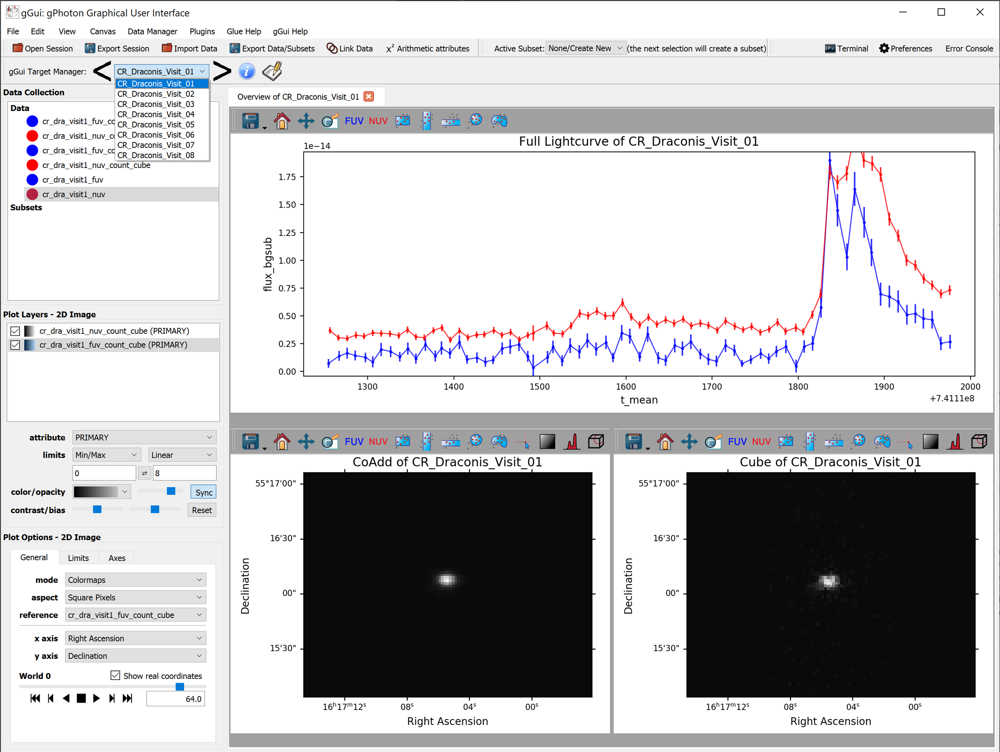

.. gGui documentation master file, created by
   sphinx-quickstart on Mon May  6 22:57:10 2019.
   You can adapt this file completely to your liking, but it should at least
   contain the root `toctree` directive.

gPhoton Glue User Interface (gGui) Documentation
################################################

gGui is a data-analysis package written atop the Glue Visualization Python library to visualize data from the GALEX Space Telescope data reduction pipeline, gPhoton.

gGui is currently actively developed and maintained by `Duy Nguyen <dnguyen@nrao.edu>`_ and `Scott Fleming <fleming@stsci.edu>`_

The latest release is hosted on PyPI. To install, simply use pip!

``pip install ggui``

.. toctree::
   :maxdepth: 2
   :caption: Contents:

   about
   using_ggui
   team
   known_issues

Indices and tables
==================

* :ref:`genindex`
* :ref:`modindex`
* :ref:`search`

Acknowledgements
================
We would like to acknowledge Chase Million for producing and maintaining the gPhoton project, whose data gGui is targeted to process.
We would also like to thank Alyssa Goodman, Thomas Robitaille, Christopher Beaumont, and the entire Glue team for their contributions to the Glue visualization tool, without whom gGui could not exist.
