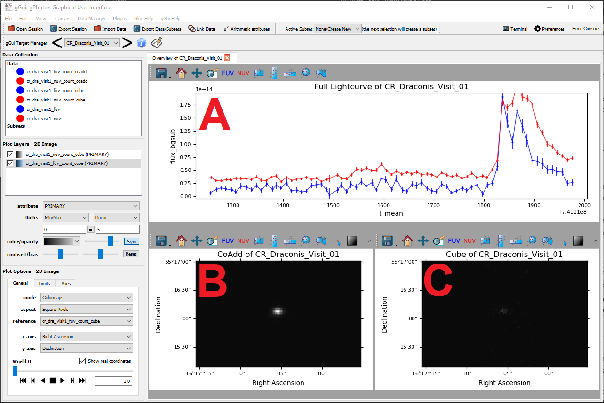

Using gGui
##########

Installing gGui
===============
gGui is hosted on `PyPI <https://pypi.org/project/ggui/>`_. To install, simply use pip:
::

    pip install ggui

Alternatively you may download and install directly from our GitHub repository, again using pip:
::

    git clone https://github.com/gphoton-tools/ggui.git
    pip install ./ggui

gGui Target Catalog
===================
gGui ingests a list of targets and associated paths to data products. To create this file, you can use our ``make_param`` utility.

Alternatively, you can write this file yourself. This file is written in the YAML standard and expects the following format:
::

    <Target Name>
        <Data Product Type>
            <Band>: <Absolute path to file>

for example:
::

    Andromeda Galaxy
        lightcurve
            NUV: /home/ggui_data/andromeda_nuv_lightcurve.csv
            FUV: /home/ggui_data/andromeda_fuv_lightcurve.csv
        coadd
            NUV: /home/ggui_data/andromeda_nuv_coadd.fits
        cube
            NUV: /home/ggui_data/andromeda_nuv_cube.fits
            FUV: /home/ggui_data/andromeda_fuv_cube.fits

gGui Configuration File
=======================
gGui configures itself, and its environment, using a python configuration file: ``ggui.conf``. This file is located with the source code (the result of ``import ggui; import os; os.path.dirname(ggui.__file__)``) and should be modified to fit your needs. The configuration file contains two fields. 

``[Mandatory Fields]`` defines which fields will be assigned to which axes. gGui comes out-of-the-box configured for gPhoton lightcurves, coadds, and cubes:
::

    [Mandatory Fields]
    lightcurve_x = t_mean
    lightcurve_y = flux_bgsub

    coadd_x = Right Ascension
    coadd_y = Declination

    cube_x = Right Ascension
    cube_y = Declination

If multiple bands are provided for each data product type (i.e. lightcurves, coadds, cubes), gGui will automatically attempt to `glue <http://docs.glueviz.org/en/stable/getting_started/index.html#linking-data>`_ these fields together.

``[Additional Fields to Glue]`` defines additional fields gGui should associate, and therefore glue together. Multiple fields can be specified, comma delimited. Once again, gGui is configured by default for gPhoton data products:
::

    [Additional Fields To Glue]
    cube = World 0
    lightcurve = t0,t1

Launching gGui
==============
Assuming you have a properly formatted target list, and have configured the gGui fields of your data, gGui can be started with two independent flags:

``ggui --target_list <path to gGui Target List>`` will automatically load a specific target list into a new gGui session.

``ggui --yaml_select`` will open a file select dialog to select your target list(s). After which, gGui will load these targets into a new gGui session.

If you are in an IPython environment, you can invoke gGui's main() function to use these flags as well: ``from ggui import ggui; ggui.main(['--target_list', '<path to gGui Target List'])``

gGui is built atop the Glue Visualization Python Library. To learn more about the framework, please see `Glue's Quickstart Guide <http://docs.glueviz.org/en/stable/getting_started/index.html>`_:

.. image:: http://docs.glueviz.org/en/stable/_images/main_window1.png
    :target: http://docs.glueviz.org/en/stable/getting_started/index.html
    :alt: Image of a blank Glue canvas with each module/area labeled

gGui provides three major features atop Glue: The gGui Target Manager, gGui Notepad, and automatic tabview generation. 

The gGui Target Manager
=======================
Accessed via the primary Glue toolbar in the upper left, the gGui Target Manager handles the loading of your target's data:

.. image:: images/ggui_targman_highlight.png
    :alt: gGui window with the Target Manager drop down expanded to show multiple targets

The Target Manager stores all of the targets identified by gGui from your target list(s). gGui only loads the data of the target selected, also known as `lazy evaluation <https://en.wikipedia.org/wiki/Lazy_evaluation>`_. One can advance targets by selecting the specific target from the dropdown list, or using the left/right arrows to advance to the previous/next target respectively. The information button will display the current target name and the parent gGui Target Catalog file this target originated from.

.. _ggui_notepad:

The gGui Notepad
================
The gGui Notepad features a collaborative space for teams to store observations, comments, and notes to each target. These notes are saved to the gGui target catalog. The gGui Notepad window can be launched via the notepad icon next to the Target Manager

The notepad displays the state of the notes above the editing window.

    The gGui Notepad will show the current state of the notes via three status: (a) Saved, (b) Modified and Unsaved, (c) Discarded

"Save Notes" will overwrite the notes on disk with those entered in the editing window.

"Discard Changes" will discard all changes in the editing window and restore the window to the notes stored on disk, in the gGui Target Catalog.

gGui Automatic Tabs
===================
gGui currently automatically generates (1) tab:

* The Target Overview Tab

Overview Tab
------------
The Overview Tab is currently the only tab implemented in gGui. It is intended to give a quick glance into the three data products (lightcurves, coadds, cubes) of all available bands simultaneously:

    The Overview Tab summarizing the target's (A) lightcurve, (B), Coadd, and (C) Cube, each with two bands (GALEX FUV, GALEX NUV)

When the user selects one of the widgets, gGui will display the appropriate plot options and layers for that particular widget.

Each widget generated by gGui includes FUV and NUV toggle tools. If your data originates from gPhoton, or is specified to have FUV and/or NUV bands, you can toggle the on and off via these tools. 
We are aware of a viewer focus bug: clicking on the graph of a viewer will not update the broader plot options of the corresponding viewer. As a stopgap solution, we have introduced a 'focus tool' one can press to see all the plot options for that plot
